<div align="right">
  <a href="./README.md">🇧🇷 Português</a> &nbsp;•&nbsp; 🇺🇸 <b>English</b>
</div>

<div align="center">



</div>

<div align="center">


</div>


<div align="center">

[](#-how-data-works)
[](#-web-application)
[](#-web-application)
[](#-ci-and-github-pages)

</div>

---

**Media History Registry** is a structured data system to track personal audiovisual history in Git-versioned JSON files.

It is not a streaming app, social network, recommender system, statistics dashboard, or gamifier. The MVP's goal is simple: allow a person to describe audiovisual works, record consumption events, and explore this history in a static SPA, without giving data ownership to a backend.

<div align="center">

<table>
  <tr>
    <td align="center" valign="middle" width="80">
      
    </td>
    <td>
      <strong>Media History Registry</strong><br/>
      <small>Audiovisual history tracking system based on JSON files under your full control.</small><br/>
      <a href="https://pedrolabre.github.io/media-history-registry/" target="_blank">
        
      </a>
    </td>
  </tr>
</table>

</div>

---

## 📌 Table of Contents

1. [✅ MVP Status](#-mvp-status)
2. [⚙️ How data works](#-how-data-works)
3. [📏 Unit system](#-unit-system)
4. [💻 Web application](#-web-application)
5. [🛠️ Local validation](#-local-validation)
6. [🚀 CI and GitHub Pages](#-ci-and-github-pages)
7. [📁 Project structure](#-project-structure)
8. [🧠 Design decisions](#-design-decisions)
9. [🚫 Out of MVP scope](#-out-of-mvp-scope)

---

## ✅ MVP Status

The current MVP delivers:

- primary data in `data/media/` and `data/history/`.
- JSON schemas for Media Item and Watch Record.
- local validation of JSONs, paths, ids, years, dates, and `media_id` relations.
- static SPA built with React + Vite + JavaScript.
- JSON loading via `import.meta.glob` during build.
- visual library by year, media, and category.
- filters by category, subcategory, genre, personal status, production status, platform, and year.
- sorting by year, title, and personal status.
- Media Item generator with preview, copy, download, filename, and expected path.
- Watch Record generator with existing Media Item selector.
- explicit manual fallback for uncommitted `media_id`.
- editable unit suggestion based on the selected media's format.
- Media Item detail page with existing comprehensive metadata.
- Watch Records timeline derived at runtime.
- orphaned Watch Records diagnostics with path, `media_id`, year, and unit.
- hash routing compatible with GitHub Pages.
- validation workflow in CI.
- static deploy workflow for GitHub Pages.

The MVP preserves the project's core rules:

- no backend.
- no database.
- no login.
- no mandatory external API.
- no automatic writing to GitHub.
- no persisted `registry.json`, `library.json`, or aggregate index.
- no derived data saved as primary source.

---

## ⚙️ How data works

The repository is the source of truth. The application interprets the files, but does not own them.

```text
Media Item = what exists
Watch Record = what you consumed
Derived Library View = how the app displays it
```

| Concept | Where it lives | Role |
|---|---|---|
| Media Item | `data/media/{category}/{id}.json` | Describes the work once |
| Watch Record | `data/history/{year}/{slug}.json` | Records a consumption event |
| Derived Library View | SPA Runtime | Groups, filters, sorts, and labels data |

This separation avoids duplicating metadata of the same work across multiple years. A series, movie, anime, documentary, or special exists as a Media Item; each season, movie, episode, arc, special, full work, or rewatch becomes a Watch Record linked by `media_id`.

---

## 📏 Unit system

Watch Records indicate the consumed unit through `unit.type`.

| Unit | Usage |
|---|---|
| `season` | Numbered season |
| `limited_season` | Limited season or miniseries |
| `episode` | Specific episode |
| `arc` | Narrative arc |
| `movie` | Movie |
| `special` | Special or extra content |
| `full_work` | Entire work as a single unit |
| `unspecified` | Unknown or undefined unit |

Labels such as `S01`, `LS`, `MOV`, `SP`, `FW`, and `ARC` are derived by the interface. They are not recorded in the primary JSONs.

---

## 💻 Web application

The SPA is located in `web/` and has two fronts.

### Library

The library reads the JSONs from the repository during the build and mounts a static snapshot. The main routes are:

| Logical route | Pages Hash | Content |
|---|---|---|
| `/` or `/library` | `#/` or `#/library` | Library by year |
| `/library/year/:year` | `#/library/year/2026` | Snippet of a year |
| `/library/media/:id` | `#/library/media/spy-family` | Detail of a work |
| `/library/category/:category` | `#/library/category/anime` | Snippet by category |
| `/generate/media` | `#/generate/media` | Media Item Generator |
| `/generate/watch-record` | `#/generate/watch-record` | Watch Record Generator |

The library displays counts, snippets, empty states, and partial data resiliently. Filters and sorting exist only in the UI; no preference is saved in JSON, URL, localStorage, or backend.

### Generators

Generators produce formatted JSON, filename, and recommended path. They allow copying or downloading the file, but do not save anything to the repository.

Expected flow:

1. fill out the form.
2. copy or download the generated JSON.
3. save the file in the indicated path under `data/`.
4. run local validation.
5. manually `git add`, `git commit`, and `git push`.

The Watch Record generator prefers selecting an already loaded Media Item, with local search by title, id, category, format, and subcategories. The manual mode remains available for cases where the work and the record are being created together before any commit.

### Detail and timeline

The media page displays the already existing fields of the Media Item: title, original title, category, subcategories, format, production status, genres, countries, studios, directors, first year, poster when existing, external ids, notes, and file origin.

The timeline is derived from the linked Watch Records. Order is calculated by year, dates, unit, and stable identifier. It displays personal status, dates, platform, rewatch, favorite, rating, and notes when this data exists.

Nothing from the timeline is saved to a derived file.

### Orphans

An orphaned Watch Record is a record whose `media_id` finds no corresponding Media Item in `data/media/`.

Local validator and CI may fail for this invalid relation. The UI remains defensive on partial snapshots: it shows the record and displays a diagnostic with id, `media_id`, origin path, year, derived unit, raw unit, and expected manual action.

---

## 🛠️ Local validation

Run validation from the repository root:

```powershell
node scriptsalidate.js
node --check scriptsalidate.js
node --check scripts\slugify.js
Get-Content -Raw -LiteralPath web\package.json | ConvertFrom-Json | Out-Null
node -e "const fs=require('fs'); JSON.parse(fs.readFileSync('web/package-lock.json','utf8'));"
```

The SPA build must be executed inside `web/`:

```powershell
cd web
npm run build
```

For a clean install of frontend dependencies:

```powershell
cd web
npm ci
```

---

## 🚀 CI and GitHub Pages

The project has two workflows:

| Workflow | When it runs | Role |
|---|---|---|
| `.github/workflows/validate.yml` | `push` and `pull_request` | Validates data, scripts, lockfile, and web build |
| `.github/workflows/deploy-pages.yml` | `push` to `main` and `workflow_dispatch` | Validates, builds, and publishes `web/dist` to GitHub Pages |

Both use Node `22.12.0`, install dependencies with `npm ci` inside `web/`, run lint/test only if scripts exist, and execute `npm run build`.

To publish to GitHub Pages, configure the repository to use GitHub Actions as the Pages source. The Vite build uses `base: "/media-history-registry/"`, and the SPA uses hash routing to work on static hosting without a backend, SSR, or server fallback.

---

## 📁 Project structure

Current public structure:

```text
media-history-registry/
|-- .github/
|   `-- workflows/
|       |-- deploy-pages.yml
|       `-- validate.yml
|-- .gitignore
|-- README.md
|-- README.en.md
|-- data/
|   |-- history/
|   `-- media/
|-- examples/
|   |-- media-example.json
|   `-- watch-record-example.json
|-- schemas/
|   |-- media.schema.json
|   `-- watch-record.schema.json
|-- scripts/
|   |-- README.md
|   |-- clear-data.js
|   |-- slugify.js
|   `-- validate.js
`-- web/
    |-- index.html
    |-- package.json
    |-- package-lock.json
    |-- vite.config.js
    `-- src/
        |-- App.jsx
        |-- components/
        |   |-- CopyButton.jsx
        |   |-- DownloadButton.jsx
        |   |-- FileInfo.jsx
        |   |-- JsonOutputBlock.jsx
        |   |-- JsonPreview.jsx
        |   |-- MediaItemGenerator.jsx
        |   |-- WatchRecordGenerator.jsx
        |   `-- library/
        |       |-- LibraryControls.jsx
        |       |-- LibraryStates.jsx
        |       |-- LibrarySummary.jsx
        |       |-- MediaSections.jsx
        |       |-- RecordList.jsx
        |       |-- WatchTimeline.jsx
        |       |-- formatting.js
        |       `-- useLibraryExplorer.js
        |-- data-loader/
        |   |-- discovery.js
        |   |-- filters.js
        |   |-- grouping.js
        |   |-- index.js
        |   |-- metrics.js
        |   |-- normalization.js
        |   |-- sorting.js
        |   `-- unitLabels.js
        |-- main.jsx
        |-- pages/
        |   |-- CategoryLibraryPage.jsx
        |   |-- LibraryPage.jsx
        |   |-- MediaLibraryPage.jsx
        |   |-- RouteNotFoundPage.jsx
        |   `-- YearLibraryPage.jsx
        |-- routes.jsx
        |-- styles.css
        `-- utils/
            |-- jsonGeneration.js
            |-- mediaItemGenerator.js
            |-- slugify.js
            `-- watchRecordGenerator.js
```

Internal planning and conclusion documents stay out of the public structure by default.

---

## 🧠 Design decisions

| Decision | Justification |
|---|---|
| JSON instead of database | Readable, portable, and versionable files |
| One file per entity | Small diffs and fewer conflicts |
| Media Item separate from Watch Record | Work metadata exists once |
| Derived labels | UI can change without migrating primary data |
| Separate statuses | Work `cancelled` is not user `dropped` |
| Manual commit | The user controls when to save and publish |
| Static build | No backend, login, API, or mandatory infrastructure |
| Hash routing | Simple compatibility with GitHub Pages |

---

## 🚫 Out of MVP scope

These fronts are left for future evolutions and are not part of the MVP:

- global search.
- advanced statistics.
- mandatory posters or visual enrichment.
- import or export.
- integrations with external APIs.
- automatic writing to GitHub.
- backend, database, login, OAuth, SSR, or multi-user support.

The project was designed to be able to grow in these directions without breaking the main rule: the audiovisual history remains owned by the user and lives in structured data in the repository.

---

<div align="center">
Developed by <b>Pedro Labre</b>
</div>
