<div align="right">
  🇧🇷 <b>Português</b> &nbsp;•&nbsp; <a href="./README.en.md">🇺🇸 English</a>
</div>

<div align="center">



</div>

<div align="center">


</div>


<div align="center">

[](#-como-os-dados-funcionam)
[](#-aplicacao-web)
[](#-aplicacao-web)
[](#-ci-e-github-pages)

</div>

---

**Media History Registry** e um sistema de dados estruturados para registrar
historico audiovisual pessoal em arquivos JSON versionados por Git.

Ele nao e um app de streaming, rede social, recomendador, dashboard de
estatisticas ou gamificador. O objetivo do MVP e simples: permitir que uma
pessoa descreva obras audiovisuais, registre eventos de consumo e explore esse
historico em uma SPA estatica, sem entregar a posse dos dados para um backend.

<div align="center">

<table>
  <tr>
    <td align="center" valign="middle" width="80">
      
    </td>
    <td>
      <strong>Media History Registry</strong><br/>
      <small>Sistema de registro de historico audiovisual baseado em arquivos JSON sob seu controle total.</small><br/>
      <a href="https://pedrolabre.github.io/media-history-registry/" target="_blank">
        
      </a>
    </td>
  </tr>
</table>

</div>

---

## 📌 Índice Geral

1. [✅ Estado do MVP](#-estado-do-mvp)
2. [⚙️ Como os dados funcionam](#-como-os-dados-funcionam)
3. [📏 Sistema de unidades](#-sistema-de-unidades)
4. [💻 Aplicacao web](#-aplicacao-web)
5. [🛠️ Validacao local](#-validacao-local)
6. [🚀 CI e GitHub Pages](#-ci-e-github-pages)
7. [📁 Estrutura do projeto](#-estrutura-do-projeto)
8. [🧠 Decisoes de design](#-decisoes-de-design)
9. [🚫 Fora do MVP](#-fora-do-mvp)

---

## ✅ Estado do MVP

O MVP atual entrega:

- dados primarios em `data/media/` e `data/history/`.
- schemas JSON para Media Item e Watch Record.
- validacao local dos JSONs, paths, ids, anos, datas e relacoes `media_id`.
- SPA estatica em React + Vite + JavaScript.
- carregamento dos JSONs por `import.meta.glob` durante o build.
- biblioteca visual por ano, midia e categoria.
- filtros por categoria, subcategoria, genero, status pessoal, status de
  producao, plataforma e ano.
- ordenacao por ano, titulo e status pessoal.
- gerador de Media Item com preview, copia, download, filename e path esperado.
- gerador de Watch Record com seletor de Media Item existente.
- fallback manual explicito para `media_id` ainda nao commitado.
- sugestao editavel de unidade a partir do formato da midia selecionada.
- pagina de detalhe de Media Item com metadados completos ja existentes.
- timeline de Watch Records derivada em runtime.
- diagnostico de Watch Records orfaos com path, `media_id`, ano e unidade.
- hash routing compativel com GitHub Pages.
- workflow de validacao em CI.
- workflow de deploy estatico para GitHub Pages.

O MVP preserva as regras centrais do projeto:

- sem backend.
- sem banco de dados.
- sem login.
- sem API externa obrigatoria.
- sem escrita automatica no GitHub.
- sem `registry.json`, `library.json` ou indice agregado persistido.
- sem dados derivados salvos como fonte primaria.

---

## ⚙️ Como os dados funcionam

O repositorio e a fonte da verdade. A aplicacao interpreta os arquivos, mas nao
e dona deles.

```text
Media Item = o que existe
Watch Record = o que voce consumiu
Derived Library View = como a aplicacao mostra
```

| Conceito | Onde vive | Papel |
|---|---|---|
| Media Item | `data/media/{category}/{id}.json` | Descreve a obra uma vez |
| Watch Record | `data/history/{year}/{slug}.json` | Registra um evento de consumo |
| Derived Library View | Runtime da SPA | Agrupa, filtra, ordena e rotula dados |

Essa separacao evita duplicar metadados da mesma obra em varios anos. Uma
serie, filme, anime, documentario ou especial existe como Media Item; cada
temporada, filme, episodio, arco, especial, obra completa ou rewatch vira um
Watch Record ligado por `media_id`.

---

## 📏 Sistema de unidades

Watch Records indicam a unidade consumida por meio de `unit.type`.

| Unidade | Uso |
|---|---|
| `season` | Temporada numerada |
| `limited_season` | Temporada limitada ou minisserie |
| `episode` | Episodio especifico |
| `arc` | Arco narrativo |
| `movie` | Filme |
| `special` | Especial ou conteudo extra |
| `full_work` | Obra inteira como unidade unica |
| `unspecified` | Unidade desconhecida ou indefinida |

Rotulos como `S01`, `LS`, `MOV`, `SP`, `FW` e `ARC` sao derivados pela
interface. Eles nao sao gravados nos JSONs primarios.

---

## 💻 Aplicacao web

A SPA fica em `web/` e tem duas frentes.

### Biblioteca

A biblioteca le os JSONs do repositorio durante o build e monta um snapshot
estatico. As rotas principais sao:

| Rota logica | Hash no Pages | Conteudo |
|---|---|---|
| `/` ou `/library` | `#/` ou `#/library` | Biblioteca por ano |
| `/library/year/:year` | `#/library/year/2026` | Recorte de um ano |
| `/library/media/:id` | `#/library/media/spy-family` | Detalhe de uma obra |
| `/library/category/:category` | `#/library/category/anime` | Recorte por categoria |
| `/generate/media` | `#/generate/media` | Gerador de Media Item |
| `/generate/watch-record` | `#/generate/watch-record` | Gerador de Watch Record |

A biblioteca mostra contagens, recortes, estados vazios e dados parciais de
forma recuperavel. Filtros e ordenacao existem apenas na UI; nenhuma
preferencia e salva em JSON, URL, localStorage ou backend.

### Geradores

Os geradores produzem JSON formatado, nome de arquivo e caminho recomendado.
Eles permitem copiar ou baixar o arquivo, mas nao salvam nada no repositorio.

Fluxo esperado:

1. preencher o formulario.
2. copiar ou baixar o JSON gerado.
3. salvar o arquivo no caminho indicado em `data/`.
4. rodar a validacao local.
5. fazer `git add`, `git commit` e `git push` manualmente.

O gerador de Watch Record prefere selecionar um Media Item ja carregado, com
busca local por titulo, id, categoria, formato e subcategorias. O modo manual
continua disponivel para o caso em que a obra e o registro estao sendo criados
juntos antes de qualquer commit.

### Detalhe e timeline

A pagina de midia exibe os campos ja existentes do Media Item: titulo, titulo
original, categoria, subcategorias, formato, status de producao, generos,
paises, estudios, diretores, primeiro ano, poster quando existir, external ids,
notas e origem do arquivo.

A timeline e derivada dos Watch Records ligados. A ordem e calculada por ano,
datas, unidade e identificador estavel. Ela exibe status pessoal, datas,
plataforma, rewatch, favorito, rating e notas quando esses dados existem.

Nada da timeline e salvo em arquivo derivado.

### Orfaos

Um Watch Record orfao e um registro cujo `media_id` nao encontra Media Item
correspondente em `data/media/`.

O validador local e o CI podem falhar para essa relacao invalida. A UI continua
defensiva em snapshots parciais: ela mostra o registro e exibe um diagnostico
com id, `media_id`, path de origem, ano, unidade derivada, unidade bruta e acao
manual esperada.

---

## 🛠️ Validacao local

Rode a validacao a partir da raiz do repositorio:

```powershell
node scripts\validate.js
node --check scripts\validate.js
node --check scripts\slugify.js
Get-Content -Raw -LiteralPath web\package.json | ConvertFrom-Json | Out-Null
node -e "const fs=require('fs'); JSON.parse(fs.readFileSync('web/package-lock.json','utf8'));"
```

O build da SPA deve ser executado dentro de `web/`:

```powershell
cd web
npm run build
```

Para uma instalacao limpa das dependencias do frontend:

```powershell
cd web
npm ci
```

---

## 🚀 CI e GitHub Pages

O projeto possui dois workflows:

| Workflow | Quando roda | Papel |
|---|---|---|
| `.github/workflows/validate.yml` | `push` e `pull_request` | Valida dados, scripts, lockfile e build web |
| `.github/workflows/deploy-pages.yml` | `push` em `main` e `workflow_dispatch` | Valida, builda e publica `web/dist` no GitHub Pages |

Ambos usam Node `22.12.0`, instalam dependencias com `npm ci` dentro de
`web/`, rodam lint/test apenas se os scripts existirem e executam
`npm run build`.

Para publicar no GitHub Pages, configure o repositorio para usar GitHub Actions
como fonte de Pages. O build Vite usa `base: "/media-history-registry/"`, e a
SPA usa hash routing para funcionar em hosting estatico sem backend, SSR ou
fallback de servidor.

---

## 📁 Estrutura do projeto

Estrutura publica atual:

```text
media-history-registry/
|-- .github/
|   `-- workflows/
|       |-- deploy-pages.yml
|       `-- validate.yml
|-- .gitignore
|-- README.md
|-- data/
|   |-- history/
|   `-- media/
|-- examples/
|   |-- media-example.json
|   `-- watch-record-example.json
|-- schemas/
|   |-- media.schema.json
|   `-- watch-record.schema.json
|-- scripts/
|   |-- README.md
|   |-- clear-data.js
|   |-- slugify.js
|   `-- validate.js
`-- web/
    |-- index.html
    |-- package.json
    |-- package-lock.json
    |-- vite.config.js
    `-- src/
        |-- App.jsx
        |-- components/
        |   |-- CopyButton.jsx
        |   |-- DownloadButton.jsx
        |   |-- FileInfo.jsx
        |   |-- JsonOutputBlock.jsx
        |   |-- JsonPreview.jsx
        |   |-- MediaItemGenerator.jsx
        |   |-- WatchRecordGenerator.jsx
        |   `-- library/
        |       |-- LibraryControls.jsx
        |       |-- LibraryStates.jsx
        |       |-- LibrarySummary.jsx
        |       |-- MediaSections.jsx
        |       |-- RecordList.jsx
        |       |-- WatchTimeline.jsx
        |       |-- formatting.js
        |       `-- useLibraryExplorer.js
        |-- data-loader/
        |   |-- discovery.js
        |   |-- filters.js
        |   |-- grouping.js
        |   |-- index.js
        |   |-- metrics.js
        |   |-- normalization.js
        |   |-- sorting.js
        |   `-- unitLabels.js
        |-- main.jsx
        |-- pages/
        |   |-- CategoryLibraryPage.jsx
        |   |-- LibraryPage.jsx
        |   |-- MediaLibraryPage.jsx
        |   |-- RouteNotFoundPage.jsx
        |   `-- YearLibraryPage.jsx
        |-- routes.jsx
        |-- styles.css
        `-- utils/
            |-- jsonGeneration.js
            |-- mediaItemGenerator.js
            |-- slugify.js
            `-- watchRecordGenerator.js
```

Documentos internos de planejamento e conclusao ficam fora da estrutura publica
por padrao.

---

## 🧠 Decisoes de design

| Decisao | Justificativa |
|---|---|
| JSON em vez de banco | Arquivos legiveis, portateis e versionaveis |
| Um arquivo por entidade | Diffs pequenos e menos conflitos |
| Media Item separado de Watch Record | Metadados da obra existem uma vez |
| Rotulos derivados | UI pode mudar sem migrar dados primarios |
| Status separados | `cancelled` da obra nao e `dropped` do usuario |
| Commit manual | O usuario controla quando salvar e publicar |
| Build estatico | Sem backend, login, API ou infraestrutura obrigatoria |
| Hash routing | Compatibilidade simples com GitHub Pages |

---

## 🚫 Fora do MVP

Estas frentes ficam para evolucoes posteriores e nao fazem parte do MVP:

- busca global.
- estatisticas avancadas.
- posters obrigatorios ou enriquecimento visual.
- importacao ou exportacao.
- integracoes com APIs externas.
- escrita automatica no GitHub.
- backend, banco, login, OAuth, SSR ou suporte multiusuario.

O projeto foi desenhado para poder crescer nessas direcoes sem quebrar a regra
principal: o historico audiovisual continua pertencendo ao usuario e vivendo em
dados estruturados no repositorio.

---

<div align="center">
Desenvolvido por <b>Pedro Labre</b>
</div>
