<div align="right">
  🇧🇷 <b>Português</b> &nbsp;•&nbsp; <a href="./README.en.md">🇺🇸 English</a>
</div>

<div align="center">



</div>

Esta pasta contém os scripts auxiliares do **Media History Registry**.

Todos os comandos devem ser executados a partir da raiz do repositório:

```powershell
node scripts\nome-do-script.js
```

---

<details>
<summary><span style="font-size: 1.5em; font-weight: 600;">🧹 <code>clear-data.js</code></span></summary>

Remove recursivamente todos os arquivos `.json` encontrados dentro da pasta `data/`.

O script foi criado principalmente para remover os dados demonstrativos antes de começar a cadastrar o histórico audiovisual real.

Ele pode apagar arquivos dentro de caminhos como:

```text
data/media/
data/history/
```

O script não modifica arquivos JSON localizados em outras pastas, como:

```text
examples/
schemas/
```

Depois da limpeza, ele preserva as pastas obrigatórias por meio dos arquivos:

```text
data/media/.gitkeep
data/history/.gitkeep
```

Isso é necessário porque o Git não versiona pastas completamente vazias, enquanto o `validate.js` exige que `data/media/` e `data/history/` existam.

### Simular a limpeza

Antes de remover os arquivos, execute o modo de simulação:

```powershell
node scripts\clear-data.js --dry-run
```

Esse comando mostra quais arquivos seriam removidos, mas não modifica o projeto.

Exemplo:

```text
Arquivos que seriam removidos:
- data/history/2024/your-name.json
- data/history/2026/spy-family-s02.json
- data/media/anime/spy-family.json

Simulação concluída: 3 arquivo(s) JSON seriam removidos.
Nenhum arquivo foi alterado.
```

### Executar a limpeza

Depois de conferir a simulação:

```powershell
node scripts\clear-data.js
```

Após a limpeza, execute a validação:

```powershell
node scripts\validate.js
```

Uma pasta `data/` sem registros JSON é válida. O resultado deve indicar:

```text
OK data/media: 0 media item file(s) checked
OK data/history: 0 watch record file(s) checked

Validation passed.
```

</details>
---

<details>
<summary><span style="font-size: 1.5em; font-weight: 600;">🔤 <code>slugify.js</code></span></summary>

Converte um texto em um slug no formato kebab-case.

Esse formato é utilizado nos IDs, nomes de arquivos e caminhos dos Media Items e Watch Records.

### Uso

```powershell
node scripts\slugify.js "Texto que será convertido"
```

Exemplo:

```powershell
node scripts\slugify.js "Spy x Family"
```

Resultado:

```text
spy-x-family
```

O script:

- converte o texto para letras minúsculas;
- remove acentos;
- remove apóstrofos;
- substitui espaços e caracteres especiais por hífens;
- remove hífens duplicados;
- remove hífens do início e do final.

Outro exemplo:

```powershell
node scripts\slugify.js "Mistborn: O Império Final"
```

Resultado:

```text
mistborn-o-imperio-final
```

Também pode ser importado por outros scripts CommonJS:

```js
const { SLUG_PATTERN, slugify } = require("./slugify");

const id = slugify("Your Name");

console.log(id);
```

</details>
---

<details>
<summary><span style="font-size: 1.5em; font-weight: 600;">🛠️ <code>validate.js</code></span></summary>

Valida os arquivos JSON, os caminhos e os relacionamentos do Media History Registry.

### Uso

```powershell
node scripts\validate.js
```

O script verifica os arquivos presentes em:

```text
schemas/
examples/
data/media/
data/history/
```

### Schemas

Verifica se os schemas obrigatórios existem e possuem as informações básicas esperadas:

```text
schemas/media.schema.json
schemas/watch-record.schema.json
```

### Exemplos

Valida os arquivos documentais presentes em:

```text
examples/
```

Os exemplos devem representar um Media Item ou um Watch Record válido.

Quando um Watch Record de exemplo referencia um `media_id`, deve existir um Media Item correspondente entre os exemplos.

### Media Items

Os Media Items devem estar no formato:

```text
data/media/{category}/{id}.json
```

Exemplo:

```text
data/media/anime/spy-family.json
```

O script verifica, entre outras regras:

- estrutura do objeto;
- propriedades obrigatórias;
- propriedades não permitidas;
- formato do `id`;
- correspondência entre o `id` e o nome do arquivo;
- correspondência entre `category` e a pasta;
- categorias permitidas;
- formatos permitidos;
- status de produção permitidos;
- códigos de país;
- IDs externos;
- anos;
- valores duplicados em listas;
- IDs de Media Items duplicados.

### Watch Records

Os Watch Records devem estar no formato:

```text
data/history/{year}/{id-sem-ano}.json
```

Exemplo:

```text
data/history/2026/spy-family-s02.json
```

Com um ID correspondente:

```json
{
  "id": "2026-spy-family-s02"
}
```

O script verifica, entre outras regras:

- estrutura do objeto;
- propriedades obrigatórias;
- propriedades não permitidas;
- formato do `id`;
- correspondência entre o ano e a pasta;
- correspondência entre o ID e o nome do arquivo;
- tipos de unidade;
- números de temporada e episódio;
- status pessoais permitidos;
- formato e validade das datas;
- data final anterior à data inicial;
- rating;
- valores booleanos;
- IDs de Watch Records duplicados.

### Relacionamentos

Cada Watch Record deve possuir um `media_id` correspondente a um Media Item existente em `data/media/`.

Por exemplo:

```json
{
  "media_id": "spy-family"
}
```

Exige a existência de um arquivo como:

```text
data/media/anime/spy-family.json
```

Caso contrário, o registro será considerado órfão e a validação falhará.

### Resultado esperado

Quando não existem erros:

```text
Media History Registry validation

OK JSON parse: 4 file(s) in schemas/, examples/ and data/
OK schemas: 2 schema file(s) checked
OK examples: 2 example file(s) checked
OK data/media: 0 media item file(s) checked
OK data/history: 0 watch record file(s) checked
OK cross-checks: paths, ids, years, media_id references and dates

Validation passed.
```

Quando algum problema é encontrado, o script informa:

- arquivo;
- campo ou localização;
- descrição do erro.

Exemplo:

```text
Validation failed with 1 error(s):

- data/history/2026/spy-family-s02.json :: $.media_id - Watch Record is orphaned; missing Media Item "spy-family"
```

O processo termina com código de erro, permitindo que a validação também seja utilizada no GitHub Actions.

### Verificar a sintaxe dos scripts

Para verificar somente a sintaxe JavaScript:

```powershell
node --check scripts\clear-data.js
node --check scripts\slugify.js
node --check scripts\validate.js
```


</details>
---

<div align="center">
Desenvolvido por <b>Pedro Labre</b>
</div>
